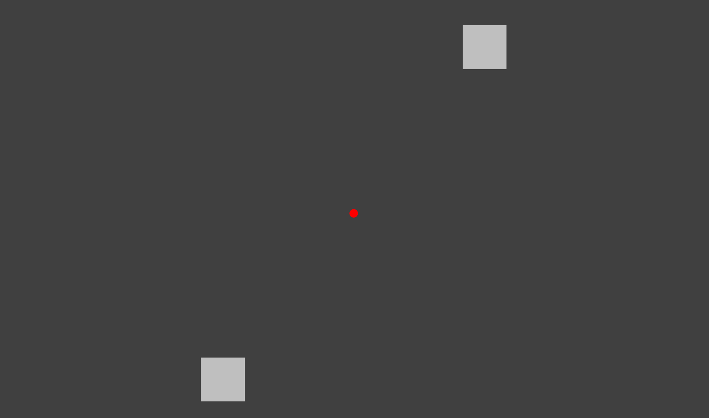
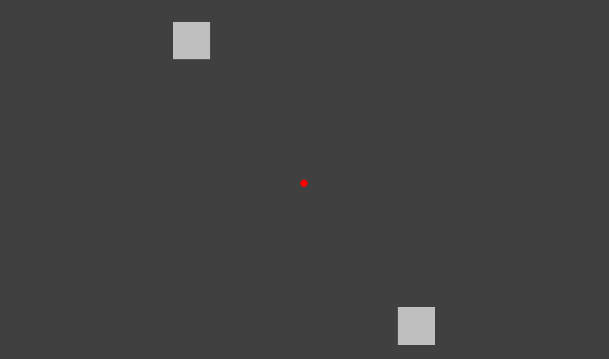

# Ambiguous motion quartet
TR = 2s
VOLUMES = 308 (10 min 20 sec)
Initial fixation of 20s, bistable quartet (80s) + flick dots (16s) for 6 times, final fixation of 20s.

# Physical (unambiguous) motion quartet: 
TR = 2s
VOLUMES = 308 (10 min 20 sec)

	block: h(10s)-v(10s)|h(10s)-v(10s)|h(10s)-v(10s)|h(10s)-v(10s)| flicker (16s)
	6 blocks repetitions

h: horizontal motion; v: vertical motion
The run begins and ends with a fixation condition (20s).

